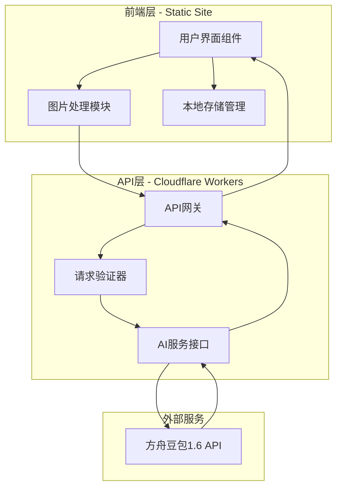
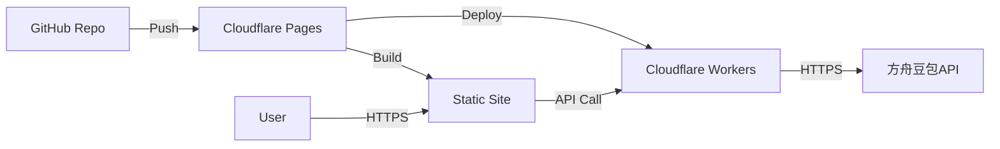
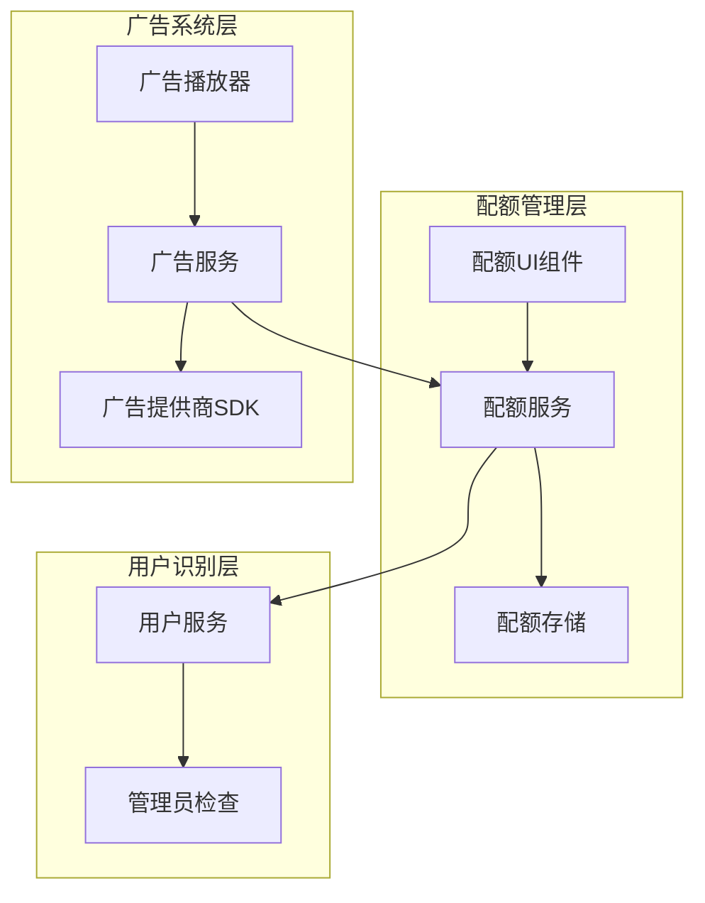
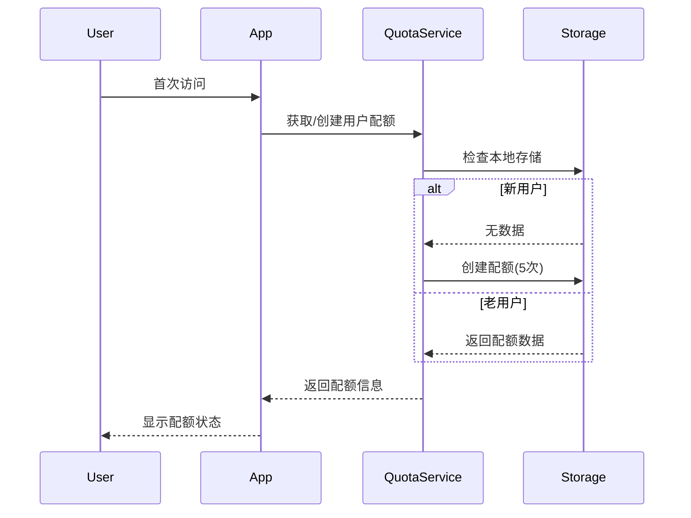
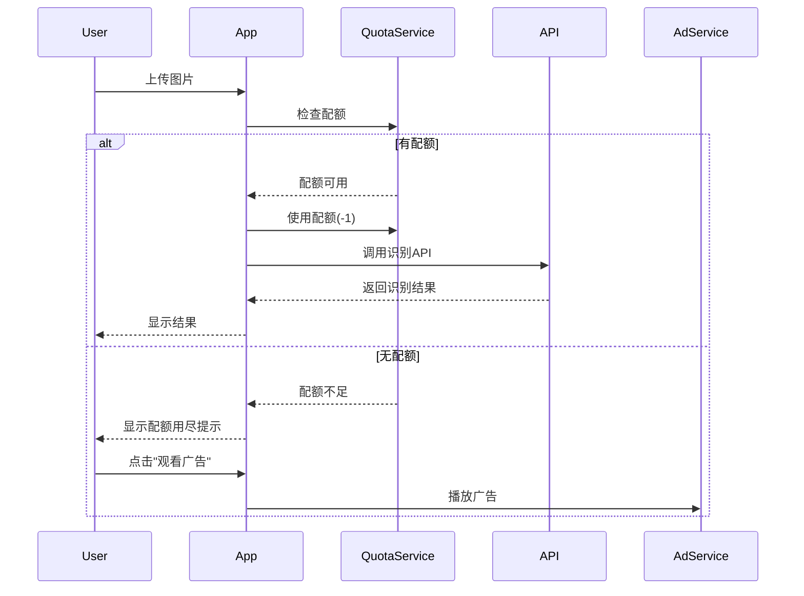
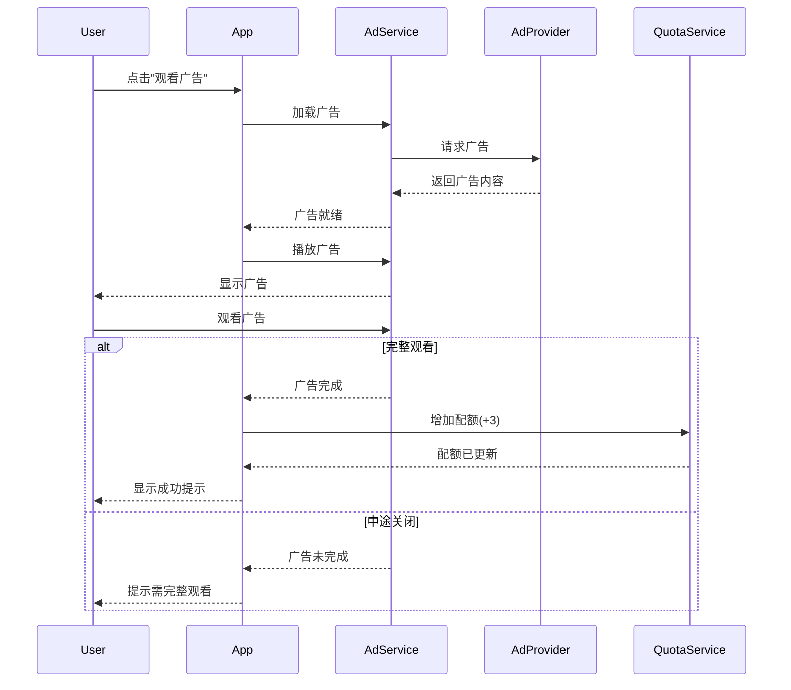
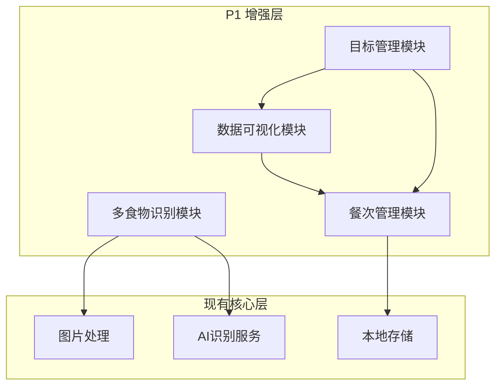

# 设计文档

## 概述

食物卡路里分析系统是一个基于Web的单页应用（SPA），采用前后端分离架构。前端使用现代JavaScript框架构建响应式用户界面，后端使用Serverless函数处理API请求和图片分析。系统集成方舟豆包1.6大模型进行食物识别和营养分析，支持部署到GitHub Pages或Cloudflare Pages等免费托管平台。

### 核心功能
- 图片上传和预处理（格式验证、压缩优化）
- 食物识别和分类
- 卡路里计算和营养成分分析
- 历史记录管理
- 响应式用户界面

### 技术栈
- **前端**: React + TypeScript + Vite
- **后端**: Cloudflare Workers (Serverless)
- **AI模型**: 方舟豆包1.6 API
- **存储**: LocalStorage (历史记录)
- **部署**: Cloudflare Pages
- **图片处理**: Browser Canvas API

## 架构

系统采用三层架构：



### 架构决策

1. **Serverless架构**: 使用Cloudflare Workers处理后端逻辑，避免服务器维护成本，符合免费部署要求
2. **前端图片预处理**: 在浏览器端完成图片压缩和格式转换，减少网络传输和API token消耗
3. **本地存储**: 使用LocalStorage保存历史记录，无需数据库，简化架构
4. **环境变量管理**: API密钥存储在Cloudflare Workers环境变量中，确保安全性

## 组件和接口

### 前端组件

#### 1. ImageUploader 组件
负责图片上传和预处理。

**接口**:
```typescript
interface ImageUploaderProps {
  onImageProcessed: (processedImage: ProcessedImage) => void;
  onError: (error: Error) => void;
}

interface ProcessedImage {
  dataUrl: string;
  originalSize: number;
  compressedSize: number;
  dimensions: { width: number; height: number };
  format: 'jpeg' | 'png' | 'webp';
}
```

**职责**:
- 验证文件格式（JPEG、PNG、WebP）
- 检查文件大小（最大10MB）
- 检测图片分辨率
- 压缩超过2MB或2048x2048的图片
- 生成预览

#### 2. AnalysisDisplay 组件
显示分析结果。

**接口**:
```typescript
interface AnalysisDisplayProps {
  result: AnalysisResult;
  onNewAnalysis: () => void;
}

interface AnalysisResult {
  foods: FoodItem[];
  totalCalories: number;
  timestamp: number;
  imageUrl: string;
  confidence?: string;
}

interface FoodItem {
  name: string;
  calories: number;
  nutrition: NutritionInfo;
}

interface NutritionInfo {
  protein: number;    // 克
  fat: number;        // 克
  carbs: number;      // 克
  fiber: number;      // 克
}
```

#### 3. HistoryList 组件
管理和显示历史记录。

**接口**:
```typescript
interface HistoryListProps {
  onSelectRecord: (record: AnalysisResult) => void;
}

interface HistoryStorage {
  saveRecord(record: AnalysisResult): void;
  getRecords(): AnalysisResult[];
  deleteRecord(timestamp: number): void;
  clearAll(): void;
}
```

#### 4. LoadingIndicator 组件
显示加载状态。

**接口**:
```typescript
interface LoadingIndicatorProps {
  message?: string;
  progress?: number;
}
```

### 后端API接口

#### POST /api/analyze
分析食物图片。

**请求**:
```typescript
interface AnalyzeRequest {
  image: string;  // Base64编码的图片
  format: string; // 图片格式
}
```

**响应**:
```typescript
interface AnalyzeResponse {
  success: boolean;
  data?: {
    foods: Array<{
      name: string;
      calories: number;
      nutrition: {
        protein: number;
        fat: number;
        carbs: number;
        fiber: number;
      };
    }>;
    totalCalories: number;
    confidence?: string;
  };
  error?: {
    code: string;
    message: string;
  };
}
```

### 方舟豆包API集成

#### 图片分析Prompt模板
```
你是一个专业的营养分析师。请分析这张食物图片，识别其中的食物并提供营养信息。

要求：
1. 识别图片中的所有食物
2. 对每种食物估算标准份量的营养成分
3. 以JSON格式返回结果

返回格式：
{
  "foods": [
    {
      "name": "食物名称",
      "calories": 卡路里数值（kcal）,
      "nutrition": {
        "protein": 蛋白质（克）,
        "fat": 脂肪（克）,
        "carbs": 碳水化合物（克）,
        "fiber": 膳食纤维（克）
      }
    }
  ],
  "confidence": "high/medium/low",
  "notes": "任何需要说明的信息"
}

如果图片中没有食物，返回：
{
  "foods": [],
  "confidence": "none",
  "notes": "未检测到食物"
}
```

## 数据模型

### AnalysisResult
存储在LocalStorage中的分析结果。

```typescript
interface AnalysisResult {
  id: string;              // UUID
  timestamp: number;       // Unix时间戳
  imageUrl: string;        // Base64或ObjectURL
  foods: FoodItem[];
  totalCalories: number;
  confidence?: string;
}
```

### FoodItem
单个食物项。

```typescript
interface FoodItem {
  name: string;
  calories: number;
  nutrition: NutritionInfo;
  portion?: string;        // 份量说明
}
```

### NutritionInfo
营养成分信息。

```typescript
interface NutritionInfo {
  protein: number;    // 蛋白质（克）
  fat: number;        // 脂肪（克）
  carbs: number;      // 碳水化合物（克）
  fiber: number;      // 膳食纤维（克）
}
```

### ImageMetadata
图片元数据。

```typescript
interface ImageMetadata {
  originalSize: number;
  compressedSize: number;
  dimensions: {
    width: number;
    height: number;
  };
  format: 'jpeg' | 'png' | 'webp';
}
```

## 正确性属性


*属性是一个特征或行为，应该在系统的所有有效执行中保持为真——本质上是关于系统应该做什么的正式声明。属性作为人类可读规范和机器可验证正确性保证之间的桥梁。*

### Property 1: 文件格式验证正确性
*对于任何*文件对象，验证函数应该接受JPEG、PNG、WebP格式的文件，并拒绝其他格式的文件
**Validates: Requirements 1.1**

### Property 2: 图片分辨率检测准确性
*对于任何*有效的图片文件，检测函数返回的分辨率应该与图片的实际宽度和高度匹配
**Validates: Requirements 1.3**

### Property 3: 高分辨率图片压缩
*对于任何*分辨率超过2048x2048的图片，压缩后的图片尺寸应该小于或等于2048x2048
**Validates: Requirements 1.4**

### Property 4: 大文件压缩
*对于任何*文件大小超过2MB的图片，压缩后的文件大小应该小于原始大小
**Validates: Requirements 1.5**

### Property 5: 压缩后预览可用性
*对于任何*成功压缩的图片，返回的数据应该包含有效的预览URL或DataURL
**Validates: Requirements 1.6**

### Property 6: API响应解析完整性
*对于任何*包含食物数据的API响应，解析函数应该正确提取所有食物名称
**Validates: Requirements 2.2**

### Property 7: 多食物列表完整性
*对于任何*包含多个食物的API响应，系统返回的食物列表长度应该等于响应中的食物数量
**Validates: Requirements 2.3**

### Property 8: 卡路里数据存在性
*对于任何*识别出的食物项，其数据结构应该包含卡路里字段且值为非负数
**Validates: Requirements 3.1**

### Property 9: 卡路里单位一致性
*对于任何*显示的卡路里值，其单位标注应该为"kcal"或"千卡"
**Validates: Requirements 3.2**

### Property 10: 卡路里总和正确性
*对于任何*包含多个食物的分析结果，总卡路里应该等于各个食物卡路里的总和
**Validates: Requirements 3.3**

### Property 11: 营养成分数据完整性
*对于任何*识别出的食物项，其营养信息应该包含蛋白质、脂肪、碳水化合物和膳食纤维四个字段
**Validates: Requirements 4.1, 4.2, 4.3, 4.4**

### Property 12: 营养成分结构化格式
*对于任何*食物的营养信息对象，应该具有标准的结构（包含protein、fat、carbs、fiber字段）
**Validates: Requirements 4.5**

### Property 13: 历史记录存储往返一致性
*对于任何*分析结果，保存到LocalStorage后再读取应该得到相同的数据（往返属性）
**Validates: Requirements 6.1**

### Property 14: 历史记录显示完整性
*对于任何*历史记录项，其显示数据应该包含缩略图URL、食物名称、卡路里值和时间戳
**Validates: Requirements 6.3**

### Property 15: 历史记录删除一致性
*对于任何*历史记录项，删除操作后从存储中查询该记录应该返回undefined或null
**Validates: Requirements 6.5**

### Property 16: API请求图片压缩验证
*对于任何*发送到API的图片数据，其大小应该小于或等于原始上传图片的大小
**Validates: Requirements 8.2**

### Property 17: 临时文件清理
*对于任何*处理完成的图片，服务器临时存储中不应该存在该文件
**Validates: Requirements 8.3**

### Property 18: 结果过滤正确性
*对于任何*分析结果，返回的食物列表中所有项的类型应该是食物相关的（非食物对象被过滤）
**Validates: Requirements 9.4**

## 错误处理

### 客户端错误处理

#### 1. 文件验证错误
- **场景**: 用户上传不支持的文件格式或超大文件
- **处理**: 
  - 显示友好的错误提示
  - 提供支持格式列表
  - 允许重新选择文件
- **错误代码**: `INVALID_FILE_FORMAT`, `FILE_TOO_LARGE`

#### 2. 图片处理错误
- **场景**: 图片损坏或无法解码
- **处理**:
  - 捕获Canvas API异常
  - 提示用户图片可能已损坏
  - 建议重新拍摄或选择其他图片
- **错误代码**: `IMAGE_DECODE_ERROR`, `COMPRESSION_FAILED`

#### 3. 网络错误
- **场景**: API请求失败、超时或网络断开
- **处理**:
  - 显示网络错误提示
  - 提供重试按钮
  - 保存用户数据避免丢失
- **错误代码**: `NETWORK_ERROR`, `REQUEST_TIMEOUT`

#### 4. 存储错误
- **场景**: LocalStorage已满或被禁用
- **处理**:
  - 提示用户清理历史记录
  - 提供导出功能
  - 降级到仅显示当前结果
- **错误代码**: `STORAGE_FULL`, `STORAGE_DISABLED`

### 服务端错误处理

#### 1. API密钥错误
- **场景**: 密钥未配置、无效或已过期
- **处理**:
  - 记录详细错误日志
  - 返回通用错误给前端
  - 触发告警通知开发者
- **错误代码**: `API_KEY_MISSING`, `API_KEY_INVALID`

#### 2. 方舟豆包API错误
- **场景**: API调用失败、限流或返回错误
- **处理**:
  - 实现指数退避重试（最多3次）
  - 记录API响应详情
  - 返回友好错误信息
- **错误代码**: `AI_API_ERROR`, `RATE_LIMIT_EXCEEDED`

#### 3. 图片处理错误
- **场景**: 图片格式不支持或处理失败
- **处理**:
  - 验证Base64解码
  - 检查图片尺寸合理性
  - 清理临时文件
- **错误代码**: `INVALID_IMAGE_DATA`, `PROCESSING_FAILED`

### 错误响应格式

所有API错误响应遵循统一格式：

```typescript
interface ErrorResponse {
  success: false;
  error: {
    code: string;
    message: string;
    details?: any;
    timestamp: number;
  };
}
```

## 测试策略

### 单元测试

使用Vitest作为测试框架，针对以下模块编写单元测试：

#### 1. 图片处理模块
- 测试文件格式验证函数
- 测试图片尺寸检测
- 测试压缩算法在边界条件下的行为
- 测试Base64编码/解码

**示例测试用例**:
```typescript
describe('ImageProcessor', () => {
  it('应该拒绝不支持的文件格式', () => {
    const file = new File([''], 'test.bmp', { type: 'image/bmp' });
    expect(() => validateFileFormat(file)).toThrow('INVALID_FILE_FORMAT');
  });
  
  it('应该接受JPEG格式', () => {
    const file = new File([''], 'test.jpg', { type: 'image/jpeg' });
    expect(validateFileFormat(file)).toBe(true);
  });
});
```

#### 2. 数据解析模块
- 测试API响应解析
- 测试营养数据提取
- 测试错误响应处理
- 测试空结果处理

#### 3. 存储模块
- 测试LocalStorage读写
- 测试数据序列化/反序列化
- 测试存储容量检查
- 测试记录删除

#### 4. 工具函数
- 测试日期格式化
- 测试数值计算（卡路里总和）
- 测试字符串处理

### 属性测试

使用fast-check库进行属性测试，验证系统在各种输入下的正确性：

#### 配置
- 每个属性测试运行至少100次迭代
- 使用随机种子确保可重现性
- 记录失败的反例

#### 测试生成器

**图片元数据生成器**:
```typescript
const imageMetadataArb = fc.record({
  width: fc.integer({ min: 100, max: 4096 }),
  height: fc.integer({ min: 100, max: 4096 }),
  size: fc.integer({ min: 1024, max: 10 * 1024 * 1024 }),
  format: fc.constantFrom('jpeg', 'png', 'webp')
});
```

**食物数据生成器**:
```typescript
const foodItemArb = fc.record({
  name: fc.string({ minLength: 1, maxLength: 50 }),
  calories: fc.integer({ min: 0, max: 2000 }),
  nutrition: fc.record({
    protein: fc.float({ min: 0, max: 100 }),
    fat: fc.float({ min: 0, max: 100 }),
    carbs: fc.float({ min: 0, max: 200 }),
    fiber: fc.float({ min: 0, max: 50 })
  })
});
```

**分析结果生成器**:
```typescript
const analysisResultArb = fc.record({
  id: fc.uuid(),
  timestamp: fc.integer({ min: 0, max: Date.now() }),
  imageUrl: fc.webUrl(),
  foods: fc.array(foodItemArb, { minLength: 0, maxLength: 10 }),
  totalCalories: fc.integer({ min: 0, max: 5000 })
});
```

#### 属性测试标注

每个属性测试必须包含注释，明确标注其对应的设计文档中的属性：

```typescript
// **Feature: food-calorie-analyzer, Property 10: 卡路里总和正确性**
it('总卡路里应该等于各食物卡路里之和', () => {
  fc.assert(
    fc.property(fc.array(foodItemArb), (foods) => {
      const result = calculateTotalCalories(foods);
      const expected = foods.reduce((sum, food) => sum + food.calories, 0);
      return result === expected;
    }),
    { numRuns: 100 }
  );
});
```

### 集成测试

#### 1. API集成测试
- 使用Mock Service Worker (MSW)模拟方舟豆包API
- 测试完整的请求-响应流程
- 测试错误场景和重试逻辑

#### 2. 端到端流程测试
- 测试从上传到显示结果的完整流程
- 测试历史记录的保存和读取
- 测试错误恢复流程

### 测试覆盖率目标

- 语句覆盖率: ≥ 80%
- 分支覆盖率: ≥ 75%
- 函数覆盖率: ≥ 85%
- 属性测试: 覆盖所有18个正确性属性

## 性能考虑

### 图片处理优化

1. **渐进式压缩**: 使用Canvas API的quality参数逐步降低质量直到满足大小要求
2. **Web Worker**: 将图片压缩放到Worker线程，避免阻塞UI
3. **缓存**: 缓存压缩后的图片，避免重复处理

### API调用优化

1. **请求去重**: 防止短时间内重复提交相同图片
2. **超时控制**: 设置30秒超时，避免长时间等待
3. **Token优化**: 
   - 压缩图片到最小可识别尺寸
   - 使用适当的图片质量参数
   - 限制图片最大尺寸为1024x1024

### 存储优化

1. **数据压缩**: 使用LZ-String压缩存储的JSON数据
2. **容量管理**: 
   - 限制历史记录最多50条
   - 自动清理超过30天的记录
   - 提供手动清理功能
3. **缩略图**: 存储小尺寸缩略图而非完整图片

### 加载性能

1. **代码分割**: 使用动态import按需加载组件
2. **资源预加载**: 预加载关键资源
3. **懒加载**: 历史记录列表使用虚拟滚动

## 安全考虑

### 前端安全

1. **输入验证**: 严格验证文件类型和大小
2. **XSS防护**: 使用React的自动转义，避免dangerouslySetInnerHTML
3. **CSP策略**: 配置Content Security Policy限制资源加载

### 后端安全

1. **API密钥保护**: 
   - 存储在环境变量
   - 不在日志中输出
   - 定期轮换
2. **请求验证**: 
   - 验证请求来源
   - 限制请求大小
   - 实现速率限制
3. **数据清理**: 
   - 处理完成后立即删除临时文件
   - 不记录用户图片内容
   - 最小化日志信息

### HTTPS

所有通信必须使用HTTPS：
- Cloudflare Pages自动提供SSL证书
- API请求强制使用HTTPS
- 混合内容策略设置为block

## 部署架构

### Cloudflare Pages部署



### 部署配置

#### 1. 前端构建
```json
{
  "build": {
    "command": "npm run build",
    "output": "dist"
  }
}
```

#### 2. Workers配置
```toml
name = "food-analyzer-api"
main = "src/worker.ts"
compatibility_date = "2024-01-01"

[env.production]
vars = { ENVIRONMENT = "production" }

[env.production.secrets]
DOUBAO_API_KEY = "从环境变量读取"
```

#### 3. 环境变量
- `DOUBAO_API_KEY`: 方舟豆包API密钥
- `DOUBAO_API_ENDPOINT`: API端点URL
- `MAX_IMAGE_SIZE`: 最大图片大小（字节）
- `RATE_LIMIT`: 速率限制配置

### CI/CD流程

1. **代码提交**: 推送到GitHub main分支
2. **自动构建**: Cloudflare Pages自动触发构建
3. **运行测试**: 执行单元测试和属性测试
4. **部署**: 测试通过后自动部署
5. **验证**: 运行smoke test验证部署

### 监控和日志

1. **Cloudflare Analytics**: 监控访问量和性能
2. **Workers日志**: 记录API调用和错误
3. **错误追踪**: 集成Sentry或类似服务
4. **性能监控**: 使用Web Vitals追踪用户体验指标

---

## P2 盈利模式设计

### 配额管理系统

#### 架构概述



#### 配额数据模型

```typescript
interface UserQuota {
  userId: string;              // 用户唯一标识（设备指纹或用户ID）
  baseQuota: number;           // 基础配额（默认5次）
  trialQuota: number;          // 试玩配额（通过广告获得）
  usedCount: number;           // 已使用次数
  totalUsed: number;           // 历史总使用次数
  lastResetDate: Date;         // 上次重置日期（可选）
  createdAt: Date;             // 创建时间
  updatedAt: Date;             // 更新时间
  isAdmin: boolean;            // 是否为管理员
}

interface QuotaTransaction {
  id: string;
  userId: string;
  type: 'use' | 'earn' | 'reset';
  amount: number;
  source: 'base' | 'ad' | 'admin';
  timestamp: Date;
  remainingQuota: number;
}

interface AdConfig {
  provider: 'google-adsense' | 'custom';
  adUnitId: string;
  adType: 'video' | 'interstitial' | 'rewarded';
  minDuration: number;         // 最小观看时长（秒）
  rewardAmount: number;        // 奖励配额数量（默认3）
  enabled: boolean;
}
```

#### 配额服务接口

```typescript
// quotaService.ts
export const quotaService = {
  // 获取用户配额信息
  getUserQuota: (userId: string) => UserQuota;
  
  // 检查是否有可用配额
  hasAvailableQuota: (userId: string) => boolean;
  
  // 使用配额
  useQuota: (userId: string) => Promise<boolean>;
  
  // 通过广告增加配额
  earnQuotaFromAd: (userId: string, amount: number) => Promise<void>;
  
  // 检查是否为管理员
  isAdmin: (userId: string) => boolean;
  
  // 获取配额历史记录
  getQuotaHistory: (userId: string) => QuotaTransaction[];
  
  // 重置配额（管理员功能）
  resetQuota: (userId: string) => void;
};
```

#### 广告服务接口

```typescript
// adService.ts
export const adService = {
  // 初始化广告SDK
  initialize: (config: AdConfig) => Promise<void>;
  
  // 加载广告
  loadAd: () => Promise<void>;
  
  // 显示广告
  showAd: () => Promise<AdResult>;
  
  // 检查广告是否可用
  isAdAvailable: () => boolean;
  
  // 获取广告配置
  getConfig: () => AdConfig;
};

interface AdResult {
  success: boolean;
  completed: boolean;
  watchedDuration: number;
  error?: string;
}
```

### UI组件设计

#### 1. QuotaIndicator 组件
显示配额状态的指示器。

**接口**:
```typescript
interface QuotaIndicatorProps {
  quota: UserQuota;
  onQuotaClick: () => void;
}
```

**职责**:
- 在顶部导航栏显示配额图标和数量
- 配额不足时显示警告样式
- 点击打开配额详情弹窗

#### 2. QuotaModal 组件
配额详情弹窗。

**接口**:
```typescript
interface QuotaModalProps {
  quota: UserQuota;
  history: QuotaTransaction[];
  onClose: () => void;
  onWatchAd: () => void;
}
```

**职责**:
- 显示基础配额和试玩配额
- 显示配额使用历史
- 提供"观看广告"按钮
- 显示管理员标识（如适用）

#### 3. AdPlayer 组件
广告播放器组件。

**接口**:
```typescript
interface AdPlayerProps {
  onAdComplete: (result: AdResult) => void;
  onAdClose: () => void;
}
```

**职责**:
- 加载和播放广告
- 显示广告进度
- 处理广告完成/跳过事件
- 显示加载状态和错误提示

#### 4. QuotaGuard 组件
配额守卫组件，包装需要配额的功能。

**接口**:
```typescript
interface QuotaGuardProps {
  children: React.ReactNode;
  onQuotaExhausted: () => void;
}
```

**职责**:
- 检查配额是否可用
- 配额不足时显示提示
- 提供"观看广告"快捷入口

### 配额管理流程

#### 用户识别流程



#### 食物识别流程（含配额检查）



#### 广告观看流程



### 配额存储策略

#### LocalStorage 结构扩展

```typescript
interface LocalStorageSchema {
  // 现有数据
  history: AnalysisResult[];
  meals: MealRecord[];
  goals: UserGoal[];
  favorites: FavoriteFood[];
  templates: MealTemplate[];
  reminders: ReminderSettings;
  userProfile: UserProfile;
  
  // P2 新增：配额管理
  userQuota: UserQuota;
  quotaHistory: QuotaTransaction[];
  adConfig: AdConfig;
}
```

#### 配额持久化

1. **实时保存**: 每次配额变化立即保存到LocalStorage
2. **事务记录**: 记录所有配额变化的历史
3. **数据校验**: 启动时验证配额数据完整性
4. **异常恢复**: 数据异常时重置为默认配额

### 管理员识别机制

#### 方案1: 设备指纹识别

```typescript
// 生成设备指纹
function generateDeviceFingerprint(): string {
  const components = [
    navigator.userAgent,
    navigator.language,
    screen.width + 'x' + screen.height,
    new Date().getTimezoneOffset(),
    navigator.hardwareConcurrency,
  ];
  return hashString(components.join('|'));
}

// 检查是否为管理员
function isAdminDevice(fingerprint: string): boolean {
  const adminFingerprints = [
    'admin_fingerprint_1',
    'admin_fingerprint_2',
  ];
  return adminFingerprints.includes(fingerprint);
}
```

#### 方案2: 密码验证

```typescript
// 管理员登录
function adminLogin(password: string): boolean {
  const adminPassword = import.meta.env.VITE_ADMIN_PASSWORD;
  if (password === adminPassword) {
    localStorage.setItem('isAdmin', 'true');
    return true;
  }
  return false;
}
```

### 广告集成方案

#### Google AdSense 集成

```typescript
// 初始化 Google AdSense
function initializeGoogleAds() {
  const script = document.createElement('script');
  script.src = 'https://pagead2.googlesyndication.com/pagead/js/adsbygoogle.js';
  script.async = true;
  script.setAttribute('data-ad-client', 'ca-pub-XXXXXXXXXXXXXXXX');
  document.head.appendChild(script);
}

// 显示激励视频广告
function showRewardedAd(): Promise<AdResult> {
  return new Promise((resolve) => {
    // Google AdSense 激励广告逻辑
    const ad = new google.ads.RewardedAd();
    ad.load();
    ad.show();
    
    ad.onReward = () => {
      resolve({ success: true, completed: true, watchedDuration: 30 });
    };
    
    ad.onClose = () => {
      resolve({ success: false, completed: false, watchedDuration: 0 });
    };
  });
}
```

### 配额正确性属性

#### Property 46: 配额扣减一致性
*对于任何*用户，成功完成一次食物识别后，配额应该减少1次
**Validates: Requirements 15.2**

#### Property 47: 配额增加一致性
*对于任何*用户，完整观看广告后，配额应该增加3次
**Validates: Requirements 15.6**

#### Property 48: 管理员无限配额
*对于任何*管理员用户，配额检查应该始终返回true
**Validates: Requirements 15.8**

#### Property 49: 配额非负性
*对于任何*用户，配额数量应该始终大于或等于0
**Validates: Requirements 15.1, 15.2**

#### Property 50: 配额持久化一致性
*对于任何*配额变化，保存后重新加载应该得到相同的配额数据
**Validates: Requirements 15.11**

### 错误处理

#### 配额系统错误

1. **配额数据损坏**
   - 检测到异常时重置为默认配额
   - 记录错误日志
   - 通知用户配额已重置

2. **广告加载失败**
   - 显示友好错误提示
   - 提供重试选项
   - 降级到无广告模式（可选）

3. **配额同步冲突**
   - 多标签页同步配额状态
   - 使用localStorage事件监听
   - 避免配额重复扣减

### 性能优化

1. **广告预加载**: 在用户配额即将用尽时预加载广告
2. **配额缓存**: 内存缓存配额状态，减少存储读取
3. **异步处理**: 配额记录异步保存，不阻塞主流程
4. **懒加载广告SDK**: 仅在需要时加载广告SDK

### 安全考虑

1. **配额防篡改**: 使用签名验证配额数据完整性
2. **管理员密码**: 使用环境变量存储，不硬编码
3. **广告收益追踪**: 记录广告观看日志用于审计
4. **速率限制**: 限制广告观看频率，防止滥用

## 技术债务和未来改进

### 短期改进
1. 添加更多图片格式支持（HEIC、AVIF）
2. 实现离线缓存（Service Worker）
3. 添加多语言支持
4. 优化广告加载性能

### 中期改进
1. 支持批量上传和分析
2. 添加食物数据库本地缓存
3. 实现用户账户系统（可选）
4. 导出历史记录为CSV/PDF
5. 集成多个广告提供商
6. 实现配额购买功能（付费解锁）

### 长期改进
1. 训练自定义食物识别模型
2. 添加营养建议和饮食计划功能
3. 集成健康追踪API（如Apple Health）
4. 开发移动应用
5. 实现云端配额同步
6. 添加会员订阅系统


---

## P1 增强功能设计

### P1 架构概述

P1增强功能在现有架构基础上添加了四个主要模块：



### P1 组件和接口

#### 1. ImageAnnotator 组件
图片标注组件，支持手动框选食物区域。

**接口**:
```typescript
interface ImageAnnotatorProps {
  imageUrl: string;
  onRegionsSelected: (regions: BoundingBox[]) => void;
}

interface BoundingBox {
  x: number;
  y: number;
  width: number;
  height: number;
}
```

**职责**:
- 显示图片预览
- 支持鼠标拖拽绘制选择框
- 支持多个选择框
- 支持调整和删除选择框
- 返回所有选择框的坐标


#### 2. MealManager 组件
餐次管理组件，提供时间轴视图和餐次操作。

**接口**:
```typescript
interface MealManagerProps {
  date: Date;
  onDateChange: (date: Date) => void;
}

interface MealRecord {
  id: string;
  userId: string;
  mealType: MealType;
  mealTime: Date;
  foods: FoodItem[];
  totalNutrition: NutritionInfo;
  notes?: string;
  photos?: string[];
  createdAt: Date;
  updatedAt: Date;
}

enum MealType {
  BREAKFAST = 'breakfast',
  LUNCH = 'lunch',
  DINNER = 'dinner',
  SNACK = 'snack'
}
```

**职责**:
- 显示每日餐次时间轴
- 按餐次类型分组显示记录
- 显示每日目标和进度
- 支持添加、编辑、删除餐次
- 智能推荐餐次类型


#### 3. QuickAddPanel 组件
快速添加面板，提供常吃食物和最近食用列表。

**接口**:
```typescript
interface QuickAddPanelProps {
  targetMealType: MealType;
  onFoodAdded: (food: FoodItem) => void;
}

interface FavoriteFood {
  id: string;
  userId: string;
  foodItem: FoodItem;
  frequency: number;
  lastUsed: Date;
  tags: string[];
  createdAt: Date;
}
```

**职责**:
- 显示按频率排序的常吃食物
- 显示最近7天食用的食物
- 支持一键添加到餐次
- 管理收藏列表
- 更新使用频率


#### 4. Charts 组件
数据可视化图表组件集合。

**接口**:
```typescript
interface CalorieTrendChartProps {
  data: ChartDataPoint[];
  goalLine: number;
  timePeriod: 'day' | 'week' | 'month';
}

interface NutritionRadarChartProps {
  actual: MacroNutrition;
  target: MacroNutrition;
}

interface MealDistributionChartProps {
  meals: MealRecord[];
  onSegmentClick: (mealType: MealType) => void;
}

interface ChartDataPoint {
  date: Date;
  calories: number;
  meals: MealRecord[];
}

interface MacroNutrition {
  protein: number;
  fat: number;
  carbs: number;
  fiber: number;
}
```

**职责**:
- 绘制卡路里趋势图（折线+柱状）
- 绘制营养雷达图
- 绘制餐次分布饼图
- 支持时间维度切换
- 支持交互式数据查看


#### 5. GoalManager 组件
目标管理组件，支持目标设置和进度追踪。

**接口**:
```typescript
interface GoalManagerProps {
  onGoalUpdated: (goal: UserGoal) => void;
}

interface UserGoal {
  id: string;
  userId: string;
  type: GoalType;
  startDate: Date;
  targetDate: Date;
  currentWeight?: number;
  targetWeight?: number;
  dailyCalorieGoal: number;
  macroGoals: MacroNutrition;
  progress: number;
  status: 'active' | 'completed' | 'paused';
}

enum GoalType {
  WEIGHT_LOSS = 'weight_loss',
  MUSCLE_GAIN = 'muscle_gain',
  MAINTAIN = 'maintain',
  HEALTH = 'health'
}

interface ReminderSettings {
  userId: string;
  enabled: boolean;
  mealReminders: {
    breakfast: { enabled: boolean; time: string; };
    lunch: { enabled: boolean; time: string; };
    dinner: { enabled: boolean; time: string; };
  };
  waterReminder: {
    enabled: boolean;
    interval: number;
    startTime: string;
    endTime: string;
  };
  recordReminder: {
    enabled: boolean;
    time: string;
  };
}
```

**职责**:
- 创建和编辑目标
- 计算目标进度
- 显示进度可视化
- 管理提醒设置
- 发送浏览器通知


### P1 正确性属性

*属性是一个特征或行为，应该在系统的所有有效执行中保持为真——本质上是关于系统应该做什么的正式声明。属性作为人类可读规范和机器可验证正确性保证之间的桥梁。*

#### 多食物识别属性

Property 19: 选择框坐标传递完整性
*对于任何*选择框集合，API请求应该包含所有选择框的坐标信息
**Validates: Requirements 11.4**

Property 20: 多食物列表显示完整性
*对于任何*多食物识别结果，显示的食物数量应该等于识别返回的食物数量
**Validates: Requirements 11.5**

Property 21: 边界框信息显示
*对于任何*包含边界框的食物项，显示时应该包含其位置信息
**Validates: Requirements 11.6**

Property 22: 食物删除一致性
*对于任何*食物列表，删除一个食物后列表长度应该减1且该食物不再存在
**Validates: Requirements 11.7**

Property 23: 份量调整营养计算
*对于任何*食物项，将份量调整为原来的N倍后，所有营养值应该也变为原来的N倍
**Validates: Requirements 11.8**

Property 24: 多食物营养总和
*对于任何*食物列表，总营养值应该等于各个食物营养值的总和
**Validates: Requirements 11.9**


#### 餐次管理属性

Property 25: 时间到餐次类型映射
*对于任何*时间，系统推荐的餐次类型应该符合时段规则（5-10早餐，11-14午餐，17-21晚餐，其他加餐）
**Validates: Requirements 12.2, 12.3, 12.4, 12.5**

Property 26: 餐次分组显示
*对于任何*日期的餐次记录，按餐次类型分组后每组应该只包含该类型的餐次
**Validates: Requirements 12.6**

Property 27: 餐次展开信息完整性
*对于任何*餐次，展开显示时应该包含所有食物项和正确的营养小计
**Validates: Requirements 12.8**

Property 28: 收藏食物往返一致性
*对于任何*食物项，添加到收藏后再检索应该得到相同的食物信息
**Validates: Requirements 12.9**

Property 29: 常吃食物频率排序
*对于任何*常吃食物列表，应该按使用频率降序排列
**Validates: Requirements 12.10**

Property 30: 最近食用时间过滤
*对于任何*最近食用列表，所有食物的最后使用时间应该在最近7天内
**Validates: Requirements 12.11**

Property 31: 快速添加频率更新
*对于任何*从快速添加面板选择的食物，其使用频率应该增加1
**Validates: Requirements 12.12**

Property 32: 模板往返一致性
*对于任何*饮食模板，保存后再读取应该得到相同的食物列表和营养信息
**Validates: Requirements 12.13**

Property 33: 模板应用完整性
*对于任何*饮食模板，应用到餐次后该餐次应该包含模板中的所有食物
**Validates: Requirements 12.14**

Property 34: 餐次删除一致性
*对于任何*餐次记录，删除后从存储中查询应该返回undefined
**Validates: Requirements 12.15**


#### 数据可视化属性

Property 35: 目标线显示
*对于任何*设置了目标的卡路里趋势图，应该显示目标线
**Validates: Requirements 13.3**

Property 36: 雷达图双值显示
*对于任何*营养雷达图，应该同时显示实际值和目标值两个数据系列
**Validates: Requirements 13.7**

Property 37: 餐次分布完整性
*对于任何*餐次分布图，应该包含所有四种餐次类型的扇区（即使某些为0）
**Validates: Requirements 13.9**

Property 38: 时间维度数据过滤
*对于任何*时间维度选择，图表数据应该只包含该时间范围内的餐次记录
**Validates: Requirements 13.11, 13.12, 13.13**

Property 39: 时间范围数据完整性
*对于任何*指定的时间范围，图表应该包含该范围内的所有餐次记录
**Validates: Requirements 13.14**

Property 40: 平均卡路里计算准确性
*对于任何*餐次记录集合，平均每日卡路里应该等于总卡路里除以天数
**Validates: Requirements 13.15**


#### 目标管理属性

Property 41: 目标验证
*对于任何*目标数据，如果缺少必填字段或数值不合理，保存操作应该失败
**Validates: Requirements 14.5**

Property 42: 进度百分比计算
*对于任何*每日摄入和目标值，进度百分比应该等于（实际摄入/目标值）× 100
**Validates: Requirements 14.6**

Property 43: 连续达标徽章显示
*对于任何*连续达标天数大于等于3的情况，应该显示连续达标徽章
**Validates: Requirements 14.9**

Property 44: 提醒权限请求
*对于任何*未授权通知权限的情况，发送提醒前应该请求权限
**Validates: Requirements 14.14**

Property 45: 通知点击导航
*对于任何*提醒通知，点击后应该导航到对应的功能页面
**Validates: Requirements 14.15**


### P1 测试策略

#### 属性测试配置

使用fast-check库进行属性测试，每个测试运行至少100次迭代。

**P1测试生成器**:

```typescript
// 边界框生成器
const boundingBoxArb = fc.record({
  x: fc.integer({ min: 0, max: 1920 }),
  y: fc.integer({ min: 0, max: 1080 }),
  width: fc.integer({ min: 10, max: 500 }),
  height: fc.integer({ min: 10, max: 500 })
});

// 餐次类型生成器
const mealTypeArb = fc.constantFrom(
  'breakfast', 'lunch', 'dinner', 'snack'
);

// 餐次记录生成器
const mealRecordArb = fc.record({
  id: fc.uuid(),
  userId: fc.uuid(),
  mealType: mealTypeArb,
  mealTime: fc.date(),
  foods: fc.array(foodItemArb, { minLength: 1, maxLength: 10 }),
  totalNutrition: nutritionInfoArb,
  createdAt: fc.date()
});

// 目标生成器
const userGoalArb = fc.record({
  id: fc.uuid(),
  userId: fc.uuid(),
  type: fc.constantFrom('weight_loss', 'muscle_gain', 'maintain', 'health'),
  startDate: fc.date(),
  targetDate: fc.date(),
  dailyCalorieGoal: fc.integer({ min: 1200, max: 3000 }),
  macroGoals: fc.record({
    protein: fc.float({ min: 50, max: 200 }),
    fat: fc.float({ min: 30, max: 100 }),
    carbs: fc.float({ min: 100, max: 400 }),
    fiber: fc.float({ min: 20, max: 50 })
  }),
  progress: fc.float({ min: 0, max: 100 }),
  status: fc.constantFrom('active', 'completed', 'paused')
});
```


#### 属性测试标注示例

每个属性测试必须包含注释，明确标注其对应的设计文档中的属性：

```typescript
// **Feature: food-calorie-analyzer, Property 24: 多食物营养总和**
it('多食物总营养应该等于各食物营养之和', () => {
  fc.assert(
    fc.property(fc.array(foodItemArb), (foods) => {
      const result = calculateTotalNutrition(foods);
      const expected = foods.reduce((sum, food) => ({
        protein: sum.protein + food.nutrition.protein,
        fat: sum.fat + food.nutrition.fat,
        carbs: sum.carbs + food.nutrition.carbs,
        fiber: sum.fiber + food.nutrition.fiber
      }), { protein: 0, fat: 0, carbs: 0, fiber: 0 });
      return (
        result.protein === expected.protein &&
        result.fat === expected.fat &&
        result.carbs === expected.carbs &&
        result.fiber === expected.fiber
      );
    }),
    { numRuns: 100 }
  );
});

// **Feature: food-calorie-analyzer, Property 25: 时间到餐次类型映射**
it('时间应该正确映射到餐次类型', () => {
  fc.assert(
    fc.property(fc.integer({ min: 0, max: 23 }), (hour) => {
      const mealType = getMealTypeByHour(hour);
      if (hour >= 5 && hour < 10) return mealType === 'breakfast';
      if (hour >= 11 && hour < 14) return mealType === 'lunch';
      if (hour >= 17 && hour < 21) return mealType === 'dinner';
      return mealType === 'snack';
    }),
    { numRuns: 100 }
  );
});
```


### P1 数据持久化策略

#### LocalStorage 结构扩展

```typescript
interface LocalStorageSchema {
  // 现有数据
  history: AnalysisResult[];
  
  // P1 新增数据
  meals: MealRecord[];
  goals: UserGoal[];
  favorites: FavoriteFood[];
  templates: MealTemplate[];
  reminders: ReminderSettings;
  userProfile: {
    currentWeight?: number;
    height?: number;
    age?: number;
    gender?: 'male' | 'female';
  };
}
```

#### 数据管理服务

```typescript
// mealService.ts
export const mealService = {
  saveMeal: (meal: MealRecord) => void;
  getMealsByDate: (date: Date) => MealRecord[];
  getMealsByDateRange: (start: Date, end: Date) => MealRecord[];
  updateMeal: (id: string, updates: Partial<MealRecord>) => void;
  deleteMeal: (id: string) => void;
};

// goalService.ts
export const goalService = {
  saveGoal: (goal: UserGoal) => void;
  getActiveGoal: () => UserGoal | null;
  updateGoalProgress: (goalId: string) => void;
  calculateProgress: (goal: UserGoal, meals: MealRecord[]) => number;
};

// favoriteService.ts
export const favoriteService = {
  addFavorite: (food: FoodItem) => void;
  removeFavorite: (id: string) => void;
  getFavorites: () => FavoriteFood[];
  updateFrequency: (foodId: string) => void;
  getRecentFoods: (days: number) => FoodItem[];
};
```


### P1 性能优化

#### 图表渲染优化
1. **数据采样**: 月视图时对数据点进行采样，避免渲染过多点
2. **懒加载**: 图表组件按需加载，减少初始包大小
3. **缓存计算**: 使用useMemo缓存图表数据计算结果
4. **虚拟化**: 长列表使用虚拟滚动

#### 存储优化
1. **数据分片**: 按月份分片存储餐次记录
2. **索引**: 为日期和餐次类型建立索引加速查询
3. **清理策略**: 自动清理90天前的详细记录，保留统计数据
4. **压缩**: 使用LZ-String压缩大对象

#### 提醒系统优化
1. **Service Worker**: 使用Service Worker实现后台提醒
2. **批量调度**: 一次性调度所有提醒，避免重复计算
3. **节能模式**: 检测设备电量，低电量时减少提醒频率

### P1 错误处理

#### 数据验证错误
- **场景**: 用户输入无效的目标数据
- **处理**: 显示具体的验证错误信息，高亮错误字段
- **错误代码**: `INVALID_GOAL_DATA`, `INVALID_DATE_RANGE`

#### 存储容量错误
- **场景**: LocalStorage接近容量限制
- **处理**: 提示用户清理旧数据，提供一键清理功能
- **错误代码**: `STORAGE_NEAR_LIMIT`, `STORAGE_FULL`

#### 通知权限错误
- **场景**: 用户拒绝通知权限
- **处理**: 显示友好提示，说明如何在浏览器设置中启用
- **错误代码**: `NOTIFICATION_PERMISSION_DENIED`

